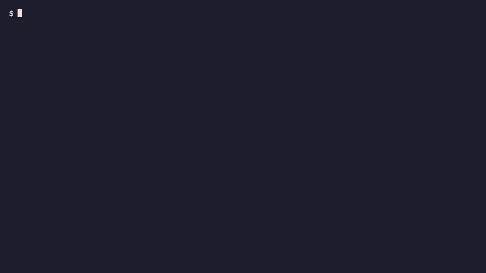

[English](README.md) · [简体中文](README.zh-CN.md) · [日本語](README.ja.md) · **한국어**

# slotdeploy

**개발자가 아닌 사람도 "preview로 올려줘" 한 마디로, 미리보기 서버를 망가뜨릴 걱정 없이.**

디자이너·마케터·운영 담당 동료가 AI 에이전트(또는 터미널 한 줄)로 수정한 내용을 미리보기 서버에 올립니다.
올린 수정이 빌드에 실패하거나 서버가 제대로 뜨지 않으면, **미리보기 서버는 이전 화면을 그대로 유지**합니다.
운영(main) 브랜치는 건드리지 않습니다. 운영 반영은 사람이 확인한 뒤에 합니다.



- Bash 명령(`bin/slotdeploy`, `bin/slotdeploy-push`)과 초기화 도우미. 실행에는 `bash`, `git`, `curl`이 필요합니다.
- 서버는 systemd 타이머(리눅스)나 launchd(macOS)로 1분마다 `preview` 브랜치를 확인합니다.
- macOS 기본 bash 3.2에서도 동작합니다.

## 어떻게 안전한가

```
동료 PC                                   미리보기 서버
slotdeploy-push push "배너 수정"           slotdeploy watch  (1분마다)
  1. 작업 브랜치(work/...)에 커밋             1. preview가 바뀌었나?
  2. 작업 브랜치 백업 push                    2. 쉬고 있는 슬롯(a 또는 b)에서 install → build → check
  3. preview 브랜치를 그 커밋으로             3. 통과하면 current 링크를 원자적으로 교체 → 재시작
     (main은 절대 push하지 않음)              4. 헬스체크 실패면 링크를 즉시 이전 슬롯으로 되돌림
                                            5. 결과를 한 줄 로그로
```

| 상황 | 결과 |
|---|---|
| 빌드 실패 (타입 오류 등) | 링크 교체 안 함. 이전 빌드가 계속 서비스됨. `FAIL ... build failed, kept 1a2b3c4` |
| 빌드는 됐는데 서버가 안 뜸 | 이전 슬롯으로 링크 복구 + 재시작. `FAIL ... health failed, kept ...` |
| 같은 실패 커밋 | 1분마다 다시 빌드하지 않음. 새 커밋이 오면 다시 시도 |
| 두 배포가 겹침 | 잠금으로 하나만 실행. 죽은 프로세스가 남긴 잠금은 자동 정리 |
| 되돌리고 싶음 | `slotdeploy-push rollback 이전` / `어제` / `<커밋>` — preview만 옮기고 내 파일은 그대로 |

클라이언트는 `main` push, `git reset`, `git stash`를 쓰지 않습니다. main 위에서 수정했더라도 변경 사항을 새 작업 브랜치로 옮겨서 올립니다.

## 설치

```bash
git clone https://github.com/Heoooooon/slotdeploy.git
sh slotdeploy/install.sh --source slotdeploy
```

한 줄 설치는 기본적으로 `~/.local/bin`을 사용하며 sudo가 필요 없습니다.

```sh
curl -fsSL https://raw.githubusercontent.com/Heoooooon/slotdeploy/main/install.sh | sh
export PATH="$HOME/.local/bin:$PATH"
curl -fsSL https://raw.githubusercontent.com/Heoooooon/slotdeploy/main/install.sh | sh -s -- update
curl -fsSL https://raw.githubusercontent.com/Heoooooon/slotdeploy/main/install.sh | sh -s -- uninstall
```

`--bin-dir`로 설치 위치, `--ref <브랜치/태그/커밋>`으로 버전을 선택합니다. 기본은 `main`이며 제거 시 설정·타이머·배포 데이터는 보존합니다.

## 빠른 초기화 (v0.2.0)

`slotdeploy init`은 저장소·배포 폴더·브랜치·빌드/재시작 명령·헬스 URL·타이머를 질문합니다. 비대화형 예:

```bash
slotdeploy -c "$HOME/site/slotdeploy.env" init --yes \
  --repo git@github.com:example/site.git --root "$HOME/site" \
  --install 'npm ci' --build 'npm run build' \
  --health-url http://127.0.0.1:3000/ --timer systemd
```

설정은 권한 600으로 만들고 기존 파일은 덮어쓰지 않습니다. `--timer systemd`는 `~/.config/systemd/user`, `--timer launchd`는 `~/Library/LaunchAgents`에 생성하고 `--timer none`은 설정만 만듭니다. `--timer-dir`, `--every 60`, `--name`, `--check`도 지원합니다. **생성만 하며 활성화하지 않습니다.** 출력된 활성화 명령을 실행하고 첫 배포는 직접 확인하세요. 로그아웃 뒤에도 systemd 사용자 타이머를 유지하려면 `loginctl enable-linger "$USER"`가 필요합니다. launchd 사용자 에이전트는 로그인 중 실행됩니다.

## 알림

설정 파일이나 Git이 아니라 **watcher의 환경 변수**로 지정합니다.

| 서비스 | 환경 변수 |
|---|---|
| 텔레그램 | `SLOTDEPLOY_TELEGRAM_URL` (봇의 전체 `/sendMessage` URL), `SLOTDEPLOY_TELEGRAM_CHAT_ID` |
| 디스코드 | `SLOTDEPLOY_DISCORD_URL` |
| 슬랙 | `SLOTDEPLOY_SLACK_URL` |

성공은 `success`, 실패는 `failure`, 재시작·헬스 실패로 이전 라이브 슬롯을 복구하면 추가로 `rollback`을 보냅니다. 클라이언트 `slotdeploy-push rollback`은 브랜치를 옮기며 watcher가 이후 배포 결과를 알립니다. 알림 실패는 배포 결과를 바꾸지 않습니다. 시간 제한을 두고 브랜치·커밋·슬롯·실패 단계만 전송하며 URL·채팅 비밀값·응답을 로그에 남기지 않습니다. 빌드 프로세스에는 알림 자격 증명을 전달하지 않습니다.

systemd에는 권한 600의 별도 `EnvironmentFile=`을 사용자 서비스 drop-in으로 연결하고, launchd에는 비공개 `EnvironmentVariables` 또는 로드 전 `launchctl setenv`로 전달하세요. 환경 변경 후 watcher를 다시 로드하세요. 비밀값을 공유 로그에 붙이거나 셸 추적을 켜지 마세요.

## 서버 설정

1. 설정 파일 작성 — 예시: [Next.js](examples/nextjs/slotdeploy.env), [정적 사이트](examples/static/slotdeploy.env)

   ```ini
   REPO_URL=git@github.com:example/myapp.git
   BRANCH=preview
   ROOT=/srv/myapp
   INSTALL_CMD=npm ci
   BUILD_CMD=npm run build
   CHECK_CMD=test -f .next/BUILD_ID          # 전환 전에 통과해야 함
   RESTART_CMD=sudo systemctl restart myapp
   HEALTH_URL=http://127.0.0.1:3000/          # 전환 후 확인, 실패하면 되돌림
   ```

   | 키 | 설명 | 기본값 |
   |---|---|---|
   | `REPO_URL` | git 원격 주소 | (필수) |
   | `BRANCH` | 감시할 브랜치 | `preview` |
   | `ROOT` | 작업 폴더. `ROOT/slots/a`, `ROOT/slots/b`, `ROOT/current`(링크) | (필수) |
   | `INSTALL_CMD`, `BUILD_CMD` | 쉬는 슬롯 안에서 실행 | 없음 |
   | `CHECK_CMD` | 전환 **전** 검사. 실패하면 서비스는 손대지 않음 | 없음 |
   | `RESTART_CMD` | 전환 후 실행 | 없음 |
   | `HEALTH_URL` | 전환 **후** `curl -f` 확인. 실패하면 이전 슬롯으로 복구 | 없음 |
   | `HEALTH_RETRIES`, `HEALTH_INTERVAL` | 헬스체크 횟수 / 간격(초) | `30`, `2` |
   | `SHARED_DIR` | git에 없는 파일(.env 등)을 슬롯마다 복사 | 없음 |
   | `KEEP` | 같은 슬롯 재빌드 때 지우지 않을 경로 | `node_modules` |

   설정 값은 불러올 때 셸로 실행되지 않습니다(명령 키만 해당 단계에서 `bash -c`로 실행). 모르는 키는 오류로 거부합니다.

2. 앱 서비스가 `ROOT/current`에서 실행되게 합니다 — [myapp.service](examples/nextjs/myapp.service), [nginx.conf](examples/static/nginx.conf).
   기존 폴더가 `ROOT/current`에 있다면 먼저 옮기세요(실제 폴더면 slotdeploy가 거부합니다).
3. 타이머 등록 — [systemd](examples/systemd/), [launchd](examples/launchd/com.example.slotdeploy.plist)

   ```bash
   slotdeploy -c /srv/myapp/slotdeploy.env deploy   # 첫 배포를 직접
   slotdeploy -c /srv/myapp/slotdeploy.env status
   tail -f /srv/myapp/slotdeploy.log
   ```

로그 예:

```
2026-05-04 10:12:31 OK   preview 3f9c1d2 slot=b 58s | Update opening hours
2026-05-04 10:27:05 FAIL preview 8e41a7b build failed, kept 3f9c1d2 (slot=b) | Type error: Property 'title' does not exist
```

실패한 빌드의 전체 출력은 `ROOT/logs/last-failed.log`에 남습니다.

## 동료 PC (클라이언트)

```bash
slotdeploy-push start                   # 수정 시작 전: 지금 preview 상태에서 새 작업 브랜치
# ... 파일 수정 ...
slotdeploy-push push "배너 문구 수정"     # 커밋 → 작업 브랜치 백업 → preview로 올리기
slotdeploy-push status                  # 지금 preview에 뭐가 올라가 있나
slotdeploy-push rollback 이전            # 방금 전으로 (= prev)
slotdeploy-push rollback 어제            # 오늘 0시 이전 마지막 상태로 (= yesterday)
slotdeploy-push rollback 1a2b3c4        # 특정 커밋으로
```

설정은 환경 변수나 `git config`로: `slotdeploy.remote`(origin), `slotdeploy.branch`(preview), `slotdeploy.prefix`(work/), `slotdeploy.protected`("main master").

## AI 에이전트에 붙이기

[examples/agent-skill/SKILL.md](examples/agent-skill/SKILL.md)를 에이전트의 스킬 폴더에 넣으면
"preview로 올려줘", "어제 상태로 돌려줘" 같은 말에 위 명령을 실행합니다.
에이전트는 운영 배포를 하지 않고, 운영 반영은 사람에게 확인을 요청하도록 적혀 있습니다.

복제한 저장소에서 패키지 스킬을 설치합니다.

```bash
mkdir -p "$HOME/.omo/agent/skills" "$HOME/.claude/skills"
cp -R skills/omo/preview-deploy "$HOME/.omo/agent/skills/"
cp -R skills/claude-code/preview-deploy "$HOME/.claude/skills/"
```

에이전트의 스킬을 다시 로드한 뒤 **"preview로 올려줘"**라고 요청하세요. push 성공과 서버 배포 확인을 구분하고, 확인하지 않은 미리보기 URL은 만들지 않습니다.

## 직접 해보기 (로컬, 서버 없이)

```bash
source demo/sandbox.sh      # /tmp/slotdeploy-demo 에 원격·서버·동료 PC를 만듭니다
edit_page "Hello"; slotdeploy-push push "hello"; slotdeploy watch; site
break_build; slotdeploy-push push "broken"; slotdeploy watch; site   # 이전 화면 유지
```

## 테스트

```bash
bash test/run.sh            # 실제 bare git 원격 + 성공/실패하는 가짜 빌드
shellcheck bin/* install.sh test/*.sh demo/sandbox.sh
```

테스트에는 Python 3.12 이상이 추가로 필요합니다(로컬 HTTP 알림·plist 검증). 실행 바이너리는 Bash·Git·curl만 필요합니다.
검증하는 것: 빌드 실패·헬스 실패·검사 실패 시 이전 유지, 같은 실패 커밋 재시도 안 함, 잠금, 롤백(이전/어제/커밋) 시 작업 파일 불변, 원격 main 불변, 보호 브랜치 거부, 설정 값 비실행.

## 하지 않는 것

- 운영 배포. slotdeploy는 미리보기 서버용입니다.
- 무중단 보장. 재시작하는 동안 짧은 끊김이 있을 수 있습니다(정적 사이트는 링크 교체만이라 끊김 없음).
- 빌드 시간 제한. 필요하면 `BUILD_CMD=timeout 600 npm run build`처럼 감싸세요.

## 라이선스

MIT
